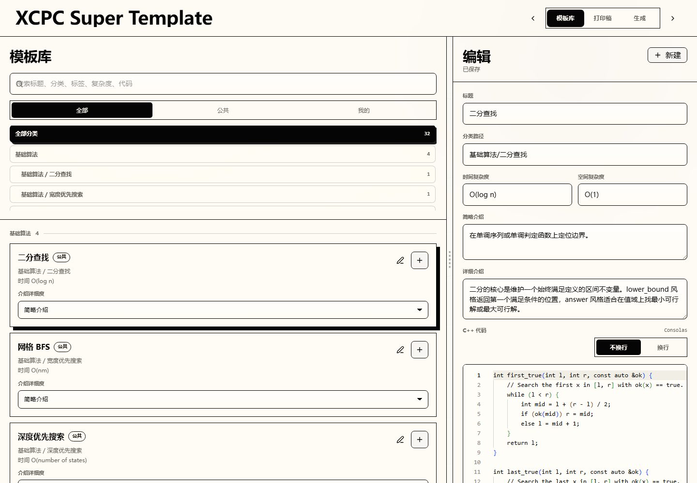

# XCPC Super Template

An offline-first ACM/XCPC template print generator.

超级板子是一个静态 Web 工作台，用来从公共板子库和本地个人板子库中勾选模板，调整顺序，配置目录/版式/介绍详细度，并导出 Markdown 或 PDF。



## Prototype

- Vue 3 + TypeScript + Vite + Tailwind CSS + shadcn-style local components.
- Public templates live in `板子/` as `meta.json + code.md`.
- Personal templates are stored in browser IndexedDB.
- Personal library supports JSON import/export.
- Sorting supports learning order, alphabetical order, manual drag-and-drop, and keyboard move buttons.
- Category sorting groups the current draft by the public template taxonomy.
- PDF export uses browser-side pagination and direct download.
- PWA build supports reopening the app offline after first load.

## Development

```bash
npm install
npm run dev
```

Production preview:

```bash
npm run build
npm run preview -- --host 127.0.0.1 --port 4173
```

## Deployment

The app is a static Vite/PWA build. For most static hosts:

```bash
npm ci
npm run build
```

Publish the generated `dist/` directory.

Recommended settings:

- Build command: `npm run build`
- Output directory: `dist`
- Node.js: 22
- Deploy at the domain root when possible.

For Cloudflare Pages, Netlify, Vercel static output, Nginx, or any plain static server, the same `dist/` directory is enough. Because the app registers a service worker, production offline mode requires HTTPS except on `localhost`.

If deploying under a subpath instead of the domain root, set Vite `base` in [`vite.config.ts`](vite.config.ts) before building so asset and service-worker paths match the final URL.

Verification:

```bash
npm run validate:templates
npm test
npm run build
npm run test:e2e
npm run qa:pdf
npm audit --audit-level=high
```

`npm run qa:pdf` writes paginated visual QA samples to `output/pdf-qa/`, including
compact/book PNG page screenshots and a `report.json` with TOC page numbers and
layout warnings.

## Project Docs

- Product requirements: [`docs/PRD.md`](docs/PRD.md)
- Roadmap: [`docs/ROADMAP.md`](docs/ROADMAP.md)
- Release contracts: [`docs/RELEASE_CONTRACTS.md`](docs/RELEASE_CONTRACTS.md)
- Release notes draft: [`docs/RELEASE_NOTES_DRAFT.md`](docs/RELEASE_NOTES_DRAFT.md)
- Changelog: [`CHANGELOG.md`](CHANGELOG.md)
- User trial plan: [`docs/USER_TRIAL_PLAN.md`](docs/USER_TRIAL_PLAN.md)
- Contributing: [`CONTRIBUTING.md`](CONTRIBUTING.md)
- Sample template PR: [`docs/SAMPLE_TEMPLATE_PR.md`](docs/SAMPLE_TEMPLATE_PR.md)
- Public template schema: [`板子/meta.schema.json`](板子/meta.schema.json)
- Public template taxonomy: [`板子/TAXONOMY.md`](板子/TAXONOMY.md)

## License

This project is licensed under GPL-3.0.

See [docs/PRD.md](docs/PRD.md).
